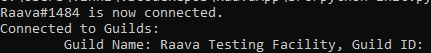

    

# Table of Contents
* [Raava](#raava)
* [Installation](#installation)
* [Commands](#commands)
* [Logging](#logging)

<a name="raava"/>

# Raava

    

Raava is a Discord Bot Application that provides basic server information, server logging, and various other fun text-based commands that users can invoke in their personal Discord Servers.

<a name="installation"/>

# Installation
#### Required Software/Tools Prior to Installation 
Python 3.7+, pip (if not already installed), Discord account

#### Required Python Packages (install using pip) 
dotenv, discord, pytz 

#### Section 1: Creating and Configuring Your RaavaApp Application
Raava is not currently hosted online, so you must create and configure a Discord Application to host your Bot locally and connect with the code provided in this repository.

1. Clone this repository to an accessible location.
2. Create a Discord Application to host your Raava Bot on the Discord Developers Portal (click on `New Application` located at: https://discord.com/developers/applications).
3. Click on the `Bot` tab and obtain your personal Bot Token by clicking `Copy` under the Token subsection.
    **NOTE: Do NOT post this Token anywhere or reveal it to anyone else, this Token can allow others to take control and make malicious changes to your Bot.**
4. Open your locally cloned RaavaApp folder and go to the `src` folder.
5. Open `example.env` in a text editor (Notepad, Notepad++, VS Code, etc.) and replace `INSERT_TOKEN_HERE` with your copied Bot Token.
6. Rename `example.env` to `.env`.

#### Section 2: Adding Raava to Your Server
Your RaavaApp application has now been setup, and now you must add Raava to your Discord server.

1. Go back to your RaavaApp page on the Discord Developers Portal.
2. Click to the `OAuth2` tab.
3. Check the *bot* checkbox under the **Scopes** subsection.
4. Check the *Administrator* checkbox under the **Bot Permissions** subsection (which should have appeared after you checked the previous checkbox).
5. Click the `Copy` button next to the URL generated under the **Scopes** subsection and paste it into your browser's navigation bar.  
6. Press Enter, and on the proceeding webpage, select the server you wish to add Raava to.
7. Click `Authorize` 

#### Section 3: Starting Raava
Raava has now been successfully added to your server, and now you just need to start the Bot!
1. Open up your operating system's command line utility/terminal (Windows: Command Prompt, Mac & Linux: Terminal)
2. Navigate to your local cloned directory of this RaavaApp repository (using the `cd` command)
3. Navigate to the `src` directory
4. Enter into console: python init.py

You're done! Raava is now online in your server and should display a startup message that looks like this (except with your unique name for Raava and server you connected it to):

    

Now you can perform any of Raava's utilities on your own server and modify it if you wish. If you want to shut down Raava before turning off your computer, use the `+shutdown` command. Repeat the steps under the **Section 3: Starting Raava** section to restart Raava again. 

<a name="commands"/>

# Commands
The command prefix for Raava's commands is '+'. For example, in order to execute the help command, you would type: `+help` in a Discord text channel that has Raava added to their server.

* **cring** - Sends a message containing the phrase "CRING" to the text channel where this command was invoked.

* **cringreact** - Adds the reaction: `C R I N G` (using Discord's regional indicator letter emojis) to the message prior to the message invoking this command. Deletes the message that invokes this command after adding reactions. 

* **help** - Default help command for information about Raava and its associated commands. Sends a direct message (DM) to the command invoker containing a link to this README document and a list of Raava's commands.

* **getavatar \[USER_ID\]** - Retrieves and sends the respective server member's icon image. Input parameter is the respective server member's Discord ID (can be retrieved by right-clicking on the user and clicking "Copy ID") .

* **postcring** - Sends a random "YOU POSTED CRING" image to the text channel where this command is invoked.

* **servericon** - Retrieves and sends the respective server's icon image where this command is invoked.

* **shutdown** - Disconnects Raava Bot's Discord Client connection and shuts the bot down. *Only available to members who have the `Administrator` role permission in the respective server(s) which Raava is connected to*.

<a name="logging"/>

# Logging
Raava enables for file-based logging of different user/server events in your local directory of `RaavaApp`. Logs for all servers which Raava is added to can be found by default in the RaavaApp directory: `RaavaApp\serverlogs\`. 

Logs for each specific server that Raava is connected to are located in a folder labeled by the server's unique ID. For example, the Discord server that has the ID `123456789` will have their respective log files stored in the directory: `RaavaApp\serverlogs\123456789`.

#### \@everyone/\@here Logging
Whenever a user invokes a mass-ping on the server through the `@everyone` or `@here` commands, Raava will log their Discord username + discriminator, and a timestamp of when their message containing the mass-ping was sent in the file: `evLog.txt`. 

#### Member Removal Logging
Whenever a user is kicked, banned, leaves, or is removed in some other fashion, Raava will log their Discord username + discriminator, and a timestamp of when they were removed in the file `leaveLog.txt`.

#### Message Deletion Logging
Whenever a message is deleted inside a server, Raava will log the message author's Discord username + discriminator, time of their message, channel the message was sent to, and a timestamp of when the message was deleted in the file `msgDeleteLog.txt` 
